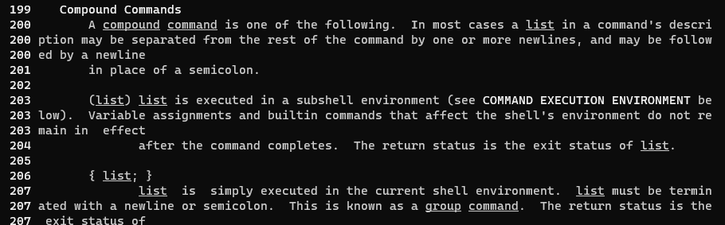

# Домашнее задание к занятию "Работа в терминале. Лекция 1"


1. С помощью базового файла конфигурации запустите Ubuntu 20.04 в VirtualBox посредством Vagrant:

	* Создал директорию C:\vagrant\vm, в которой будут храниться конфигурационные файлы Vagrant и образ системы, скачанный с https://app.vagrantup.com/bento/boxes/ubuntu-20.04/versions/202212.11.0/providers/virtualbox.box. Переименовал скачанный образ в "bento-ubuntu20.box". Запустил командую строку в C:\vagrant\vm и выполнил `vagrant init`. Заменил содержимое Vagrantfile по умолчанию следующим:

		```bash
		Vagrant.configure("2") do |config|
			config.vm.box = "bento-ubuntu20.box"
		end
		```

	* Выполнил в терминале Windows в директории C:\vagrant\vm команду `vagrant up`. В терминале увидел сообщение, что машина стартанула: `==> default: Machine booted and ready!` 

	* Попрактиковался в выполнении команд `vagrant suspend`, `vagrant up` и `vagrant halt`, параллельно наблюдая за происходящим в окне Oracle VM VirtualBox Менеджер.

2. Ознакомьтесь с графическим интерфейсом VirtualBox, посмотрите как выглядит виртуальная машина, которую создал для вас Vagrant, какие аппаратные ресурсы ей выделены. Какие ресурсы выделены по-умолчанию?

##### Ответ:


3. Ознакомьтесь с возможностями конфигурации VirtualBox через Vagrantfile: [документация](https://www.vagrantup.com/docs/providers/virtualbox/configuration.html). Как добавить оперативной памяти или ресурсов процессора виртуальной машине?

##### Ответ:

Для изменения количества ресурсов, выделяемых виртуальной машине, отредактировал Vagrantfile

	
        Vagrant.configure("2") do |config|
            config.vm.box = "bento-ubuntu20.box"
            config.vm.provider "virtualbox" do |vb|
                vb.memory = 2048
                vb.cpus = 2
            end
        end
	
	
Сохранил файл конфигурации, выполнил в терминале команду `vagrant reload`, убедился, что памяти стало больше


4. Использовал команду `vagrant ssh` из директории, в которой содержится Vagrantfile, попрактиковался в выполнении команд в терминале Ubuntu.

##### Ответ:


5. Ознакомьтесь с разделами `man bash`, почитайте о настройках самого bash:
    * какой переменной можно задать длину журнала `history`, и на какой строчке manual это описывается?
    
    ##### Ответ:
    В моем случае в `man bash` на строке 621 описывается переменная HISTFILESIZE - максимальное количество команд хранящихся в файле истории.
    На строке 630 описывается переменная HISTSIZE - определяет количество команд, которые необходимо запомнить в истории команд.
    
    
    * что делает директива `ignoreboth` в bash?
    
    ##### Ответ:
    Директива `ignoreboth` позволяет использовать обе опции `ignorespace (не сохранять строки начинающиеся с пробела)` и `ignoredups (не сохранять строки, совпадающие с последней выполненной командой)`
    
6. В каких сценариях использования применимы скобки `{}` и на какой строчке `man bash` это описано?
##### Ответ:
Фигурные скобки помогают сократить количество ручного ввода в командной строке, например, создать посредством одной составной команды большое количество файлов . В моем случае скобки описание `{}` появилось на строке 206 в `man bash` в разделе мануала `Compound Commands`


7. С учётом ответа на предыдущий вопрос, как создать однократным вызовом `touch` 100000 файлов? Получится ли аналогичным образом создать 300000? Если нет, то почему?
##### Ответ: 
Команда `touch {1..100000}` позволила создать 100000 файлов в текущей директории, команда `touch {1..300000}` выбросила ошибку `-bash: /usr/bin/rm: Argument list too long`, которая означает, что мы превысили максимальную длину командной строки, разрешенную для аргументов в команде

8. В man bash поищите по `/\[\[`. Что делает конструкция `[[ -d /tmp ]]`
##### Ответ:
В моем интерпретаторе в `man bash` нашёл конструкцию `[[ expression ]]`, которая возвращает статус 0 или 1 в зависимости от оценки выражения условного выражения, конструкция `-d file` означает, что мы получим True, если файл существует и является каталогом.
Проверяем:


9. Сделайте так, чтобы в выводе команды `type -a bash` первым стояла запись с нестандартным путем, например bash is ... 
Используйте знания о просмотре существующих и создании новых переменных окружения, обратите внимание на переменную окружения PATH 

	```bash
	bash is /tmp/new_path_directory/bash
	bash is /usr/local/bin/bash
	bash is /bin/bash
	```

	(прочие строки могут отличаться содержимым и порядком)
    В качестве ответа приведите команды, которые позволили вам добиться указанного вывода или соответствующие скриншоты.

10. Чем отличается планирование команд с помощью `batch` и `at`?

