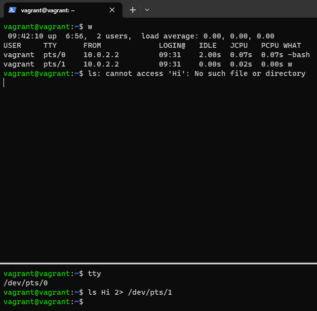
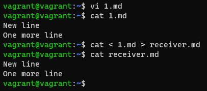
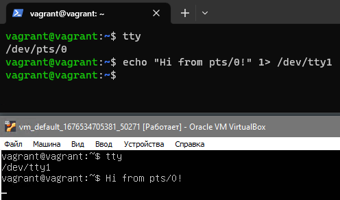
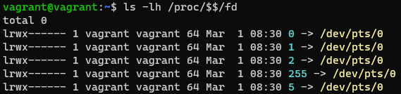
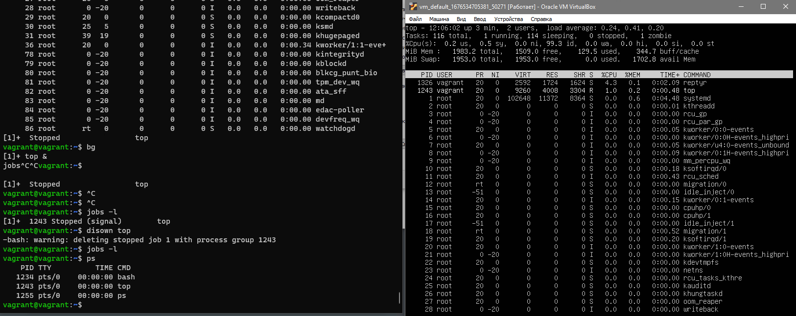

# Домашнее задание к занятию «Работа в терминале. Лекция 2»
1. Какого типа команда `cd`? Попробуйте объяснить, почему она именно такого типа: опишите ход своих мыслей и поясните, если считаете, что она могла бы быть другого типа. 

  ##### Ответ: 

Команда `cd` является встроенной, о чем говорит нам вывод. При выполнении команда меняет директорию для оболочки, в которой мы находимся, выполняется без порождения дочерних процессов. Очень удобно, что команда доступна пользователю сразу "из коробки", позволяя делать то, для чего она создана - менять директорию, не думая о дополнительных настройках и ухищрениях.

  ```bash
        vagrant@vagrant:~$ type cd
        cd is a shell builtin
  ```
2. Какая альтернатива без pipe для команды `grep <some_string> <some_file> | wc -l`?   

##### Ответ:

В	`man grep` в абзаце General Output Control находим описание ключа `-c, --count`, который позволяет вместо нормального вывода напечатать количество строк, в которых находится требуемое вхождение. Ключ `-v, --invert-match` посчитает количество строк, неподходящих под строку поиска
  
  ```bash
    vagrant@vagrant:/var/log$ grep x86 /var/log/dmesg | wc -l
    13
    vagrant@vagrant:/var/log$ grep x86 /var/log/dmesg -c
    13
    vagrant@vagrant:/var/log$ grep x86 /var/log/dmesg -c -v
    542
  ```

3. Какой процесс с PID `1` является родителем для всех процессов в вашей виртуальной машине Ubuntu 20.04?

##### Ответ:

Родительский процесс `init`

```bash
vagrant@vagrant:/var/log$ ps -aux
USER         PID %CPU %MEM    VSZ   RSS TTY      STAT START   TIME COMMAND
root           1  0.0  0.5 168112 11412 ?        Ss   02:46   0:05 /sbin/init
```

4. Как будет выглядеть команда, которая перенаправит вывод stderr `ls` на другую сессию терминала?

##### Ответ:



5. Получится ли одновременно передать команде файл на stdin и вывести её stdout в другой файл? Приведите работающий пример.

##### Ответ:



6. Получится ли, находясь в графическом режиме, вывести данные из PTY в какой-либо из эмуляторов TTY? Сможете ли вы наблюдать выводимые данные?

##### Ответ:

Вывел данные с `/dev/pts/0` в `/dev/tty1`



7. Выполните команду `bash 5>&1`. К чему она приведёт? Что будет, если вы выполните `echo netology > /proc/$$/fd/5`? Почему так происходит?

##### Ответ:

Команда `bash 5>&1` приведёт к созданию нового файлового дескриптора в текущей оболочке.



Команда `echo netology > /proc/$$/fd/5` передаёт сообщение `netology` в поток вывода созданного нами ранее дескриптора.

```bash
vagrant@vagrant:~$ echo netology > /proc/$$/fd/5
netology
```

8. Получится ли в качестве входного потока для pipe использовать только stderr команды, не потеряв отображение stdout на pty?  

##### Ответ:

Можно использовать ранее созданный нами дескриптор, синтаксис будет таким

`some_command 5>&2 2>&1 1>&5 | some_command`


  
9. Что выведет команда `cat /proc/$$/environ`? Как ещё можно получить аналогичный по содержанию вывод?

##### Ответ:

Будет выведен список переменных окружения. Можно использовать команду-аналог `env`

  
10. Используя `man`, опишите, что доступно по адресам `/proc/<PID>/cmdline`, `/proc/<PID>/exe`.

##### Ответ:

`/proc/<PID>/cmdline` Этот файл только для чтения содержит полную командную строку для процесса, если процесс не зомби.
`/proc/<PID>/exe` В Linux 2.2 и более поздних версиях этот файл представляет собой символическую ссылку, содержащую фактический путь к выполняемой команде.
  
11. Узнайте, какую наиболее старшую версию набора инструкций SSE поддерживает ваш процессор с помощью `/proc/cpuinfo`.

##### Ответ:

`sse4_2`
  
12. При открытии нового окна терминала и `vagrant ssh` создаётся новая сессия и выделяется pty.  
	Это можно подтвердить командой `tty`, которая упоминалась в лекции 3.2.  
	
	Однако:

    ```bash
	vagrant@netology1:~$ ssh localhost 'tty'
	not a tty
    ```

	Почитайте, почему так происходит и как изменить поведение.
	
##### Ответ:

Так происходит, потому что tty для выполнения команды по ssh  не выделяется по-умолчанию. Если использовать просто `ssh localhost` или использовать конструкцию для принудительного открытия псевдотерминала вида `ssh -t localhost 'tty'`, то поведение можно изменить.
	
13. Бывает, что есть необходимость переместить запущенный процесс из одной сессии в другую. Попробуйте сделать это, воспользовавшись `reptyr`. Например, так можно перенести в `screen` процесс, который вы запустили по ошибке в обычной SSH-сессии.

##### Ответ:
Поиграл с пакетом `reptyr`, перенес процесс `top` из одной сессии в другую. Пришлось править файл `/etc/sysctl.d/10-ptrace.conf`, поменял значение `kernel.yama.ptrace_scope = 0` c 1 на 0.




14. `sudo echo string > /root/new_file` не даст выполнить перенаправление под обычным пользователем, так как перенаправлением занимается процесс shell, который запущен без `sudo` под вашим пользователем. Для решения этой проблемы можно использовать конструкцию `echo string | sudo tee /root/new_file`. Узнайте, что делает команда `tee` и почему в отличие от `sudo echo` команда с `sudo tee` будет работать.

##### Ответ:

`tee` читает из стандартного ввода и записывает в стандартный вывод и файлы. Команда `echo string | sudo tee /root/new_file` отработает успешно, так как сначала выполнится `echo string`, а затем после пайпа `tee` запустится от имени суперпользователя и будет иметь права на запись в файл. 
