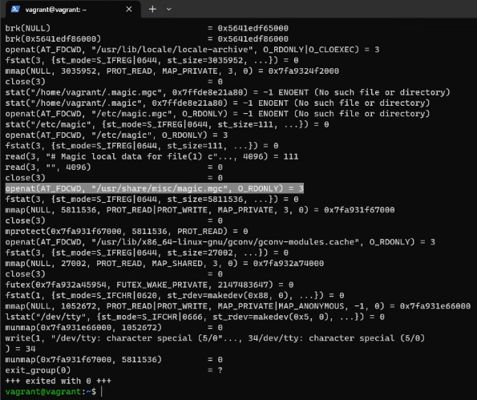

# Домашнее задание к занятию «Операционные системы. Лекция 1»
1. Какой системный вызов делает команда `cd`? 

    В прошлом ДЗ вы выяснили, что `cd` не является самостоятельной  программой. Это `shell builtin`, поэтому запустить `strace` непосредственно на `cd` не получится. Вы можете запустить `strace` на `/bin/bash -c 'cd /tmp'`. В этом случае увидите полный список системных вызовов, которые делает сам `bash` при старте. 

    Вам нужно найти тот единственный, который относится именно к `cd`. Обратите внимание, что `strace` выдаёт результат своей работы в поток stderr, а не в stdout.
    
##### Ответ:

Системный вызов `chdir("/tmp")`


---

2. Попробуйте использовать команду `file` на объекты разных типов в файловой системе. Например:

    ```bash
    vagrant@netology1:~$ file /dev/tty
    /dev/tty: character special (5/0)
    vagrant@netology1:~$ file /dev/sda
    /dev/sda: block special (8/0)
    vagrant@netology1:~$ file /bin/bash
    /bin/bash: ELF 64-bit LSB shared object, x86-64
    ```
    
    Используя `strace`, выясните, где находится база данных `file`, на основании которой она делает свои догадки.

##### Ответ:

Увидел системный вызов `openat()` по пути `/usr/share/misc/magic.mgc`



---

3. Предположим, приложение пишет лог в текстовый файл. Этот файл оказался удалён (deleted в lsof), но сказать сигналом приложению переоткрыть файлы или просто перезапустить приложение возможности нет. Так как приложение продолжает писать в удалённый файл, место на диске постепенно заканчивается. Основываясь на знаниях о перенаправлении потоков, предложите способ обнуления открытого удалённого файла, чтобы освободить место на файловой системе.

##### Ответ:

Использовал следующую последовательность команд для освобождения места:

```bash
vagrant@vagrant:~$ while true; do echo -n 'Just another ... '; done > output.log &
[1] 6431
vagrant@vagrant:~$ ls
030303.log  1.md  delete  man  output.log  receiver.md  sample.log.save  sample.md  test.log
vagrant@vagrant:~$ rm output.log
vagrant@vagrant:~$ ls
030303.log  1.md  delete  man  receiver.md  sample.log.save  sample.md  test.log
vagrant@vagrant:~$ sudo lsof -p 6431 | grep deleted
bash    6431 vagrant    1w   REG  253,0 109629923 1316942 /home/vagrant/output.log (deleted)
vagrant@vagrant:~$ df -h /; truncate -s 0 /proc/6431/fd/1; df -h /
Filesystem                         Size  Used Avail Use% Mounted on
/dev/mapper/ubuntu--vg-ubuntu--lv   31G  4.2G   25G  15% /
Filesystem                         Size  Used Avail Use% Mounted on
/dev/mapper/ubuntu--vg-ubuntu--lv   31G  4.0G   25G  14% /
```

---

4. Занимают ли зомби-процессы ресурсы в ОС (CPU, RAM, IO)?

##### Ответ:

Зомби-процесс не занимает ресурсов, такой процесс получается в том случае, когда родительский процесс по какой-либо причине не смог обработать код возврата от дочернего процесса. После своего завершения подобный дочерний процесс становится зомби и занимает строку в таблице процессов, размер которой ограничен. При достижении лимита запущенных процессов невозможно будет запустить новые дочерние процессы, то есть нельзя будет выполнять новые команды. Уничтожить зомби можно, завершив родительский процесс.

---

5. В IO Visor BCC есть утилита `opensnoop`:

    ```bash
    root@vagrant:~# dpkg -L bpfcc-tools | grep sbin/opensnoop
    /usr/sbin/opensnoop-bpfcc
    ```
    
    На какие файлы вы увидели вызовы группы `open` за первую секунду работы утилиты? Воспользуйтесь пакетом `bpfcc-tools` для Ubuntu 20.04. Дополнительные сведения по установке [по ссылке](https://github.com/iovisor/bcc/blob/master/INSTALL.md).

##### Ответ:


---

6. Какой системный вызов использует `uname -a`? Приведите цитату из man по этому системному вызову, где описывается альтернативное местоположение в `/proc` и где можно узнать версию ядра и релиз ОС.

##### Ответ:

```bash
strace uname -a
...
uname({sysname="Linux", nodename="vagrant", ...}) = 0
...
```

```bash
 /proc/version
              This string identifies the kernel version that is currently running.  It includes the contents of /proc/sys/kernel/ostype, /proc/sys/kernel/osrelease and /proc/sys/kernel/version.  For  ex‐
              ample:

        Linux version 1.0.9 (quinlan@phaze) #1 Sat May 14 01:51:54 EDT 1994
```
```bash
vagrant@vagrant:~$ cat /proc/version
Linux version 5.4.0-135-generic (buildd@lcy02-amd64-066) (gcc version 9.4.0 (Ubuntu 9.4.0-1ubuntu1~20.04.1)) #152-Ubuntu SMP Wed Nov 23 20:19:22 UTC 2022
```

---

7. Чем отличается последовательность команд через `;` и через `&&` в bash? Например:

    ```bash
    root@netology1:~# test -d /tmp/some_dir; echo Hi
    Hi
    root@netology1:~# test -d /tmp/some_dir && echo Hi
    root@netology1:~#
    ```
    
    Есть ли смысл использовать в bash `&&`, если применить `set -e`?

##### Ответ:

Применение `;` позволяет выполнять команды последовательно, вне зависимости от их кода возврата, а при использовании `&&` последующая команда выполнится только при успешном выполении предыдущей команды, то есть `код возврата = 0`.  `set -e` прервёт выполнение, если первая команда возвращает не 0, поэтому особого смысла использовать совместно с `&&` нет.

---

8. Из каких опций состоит режим bash `set -euxo pipefail`, и почему его хорошо было бы использовать в сценариях?

##### Ответ:
Воспользовался `set --help`
Режим состоит из опций:
  
`-e` - завершить немедленно, если команда возвращает ненулевой статус.
  
`-u` - рассматривать неустановленные переменные как ошибку при замене.
  
`-x` - печатать команды и их аргументы по мере их выполнения.
  
`-o pipefail` - возвращаемое значение конвейера — это статус последней команды с ненулевым статусом,или ноль, если ни одна команда не завершилась с ненулевым статусом.
  
Опции полезны при проверке и отладке скриптов.


---

9. Используя `-o stat` для `ps`, определите, какой наиболее часто встречающийся статус у процессов в системе. В `man ps` изучите (`/PROCESS STATE CODES`), что значат дополнительные к основной заглавной букве статуса процессов. Его можно не учитывать при расчёте (считать S, Ss или Ssl равнозначными).

##### Ответ:

Наиболее частый статус процессов в системе = `S` - interruptible sleep, спящий процесс, ожидает какого-то события для продолжения выполнения.

---
