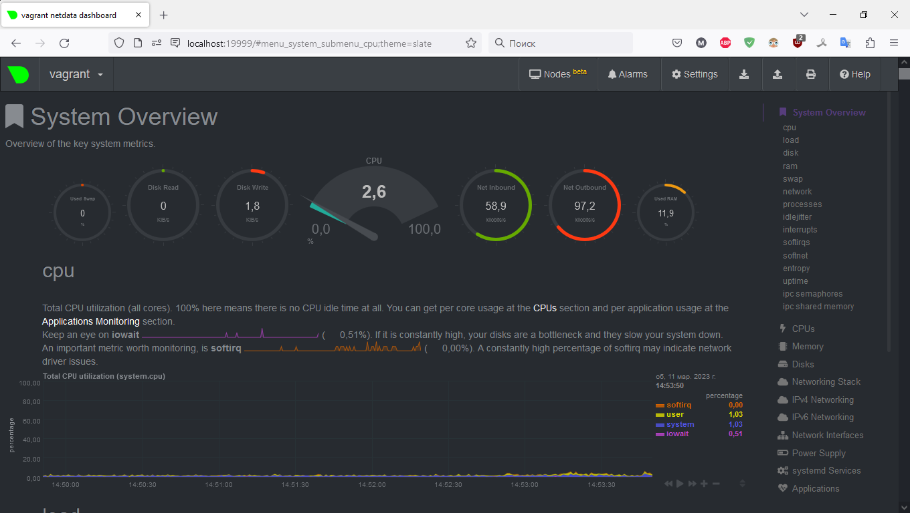

# Домашнее задание к занятию «Операционные системы. Лекция 2»

1. На лекции вы познакомились с [node_exporter](https://github.com/prometheus/node_exporter/releases). В демонстрации его исполняемый файл запускался в background. Этого достаточно для демо, но не для настоящей production-системы, где процессы должны находиться под внешним управлением. Используя знания из лекции по systemd, создайте самостоятельно простой [unit-файл](https://www.freedesktop.org/software/systemd/man/systemd.service.html) для node_exporter:

    * поместите его в автозагрузку;
    * предусмотрите возможность добавления опций к запускаемому процессу через внешний файл (посмотрите, например, на `systemctl cat cron`);
    * удостоверьтесь, что с помощью systemctl процесс корректно стартует, завершается, а после перезагрузки автоматически поднимается.  

##### Ответ:

Получаем node_exporter и размещаем в нужной директории
```bash
wget https://github.com/prometheus/node_exporter/releases/download/v1.5.0/node_exporter-1.5.0.linux-amd64.tar.gz
tar -xzvf node_exporter-1.5.0.linux-amd64.tar.gz
sudo cp node_exporter-1.5.0.linux-amd64/node_exporter /usr/local/bin
```
Создаём unit-файл для node_exporter
```bash
vagrant@vagrant:~$ sudo nano /etc/systemd/system/node_exporter.service

[Unit]
Description=Node Exporter Service
Wants=network-online.target
After=network-online.target

[Service]
EnvironmentFile=-/etc/default/node_exporter
ExecStart=/usr/local/bin/node_exporter
ExecReload=/bin/kill -HUP $MAINPID
KillMode=process
Type=simple
Restart=on-failure

[Install]
WantedBy=multi-user.target
```

Перечитываем конфигурационные файлы
```bash
vagrant@vagrant:~$ sudo systemctl daemon-reload
```

Включаем сервис
```bash
vagrant@vagrant:~$ sudo systemctl enable node_exporter
Created symlink /etc/systemd/system/multi-user.target.wants/node_exporter.service → /etc/systemd/system/node_exporter.service.
```

Стартуем сервис
```bash
vagrant@vagrant:~$ sudo systemctl start node_exporter
```

Проверяем запущенный сервис
```bash
vagrant@vagrant:~$ ps -ax | grep node_exporter
   2855 ?        Ssl    0:00 /usr/local/bin/node_exporter
   2888 pts/0    S+     0:00 grep --color=auto node_exporter
```

Останавливаем запущенный сервис и проверяем его статус
```bash
vagrant@vagrant:~$ sudo systemctl stop node_exporter
vagrant@vagrant:~$ ps -ax | grep node_exporter
   2915 pts/0    S+     0:00 grep --color=auto node_exporter
vagrant@vagrant:~$ systemctl status node_exporter
● node_exporter.service - Node Exporter Service
     Loaded: loaded (/etc/systemd/system/node_exporter.service; enabled; vendor pres>
     Active: inactive (dead) since Sat 2023-03-11 05:17:01 UTC; 2min 24s ago
    Process: 2855 ExecStart=/usr/local/bin/node_exporter (code=killed, signal=TERM)
   Main PID: 2855 (code=killed, signal=TERM)

Mar 11 05:11:42 vagrant node_exporter[2855]: ts=2023-03-11T05:11:42.163Z caller=node>
Mar 11 05:11:42 vagrant node_exporter[2855]: ts=2023-03-11T05:11:42.163Z caller=node>
Mar 11 05:11:42 vagrant node_exporter[2855]: ts=2023-03-11T05:11:42.163Z caller=node>
Mar 11 05:11:42 vagrant node_exporter[2855]: ts=2023-03-11T05:11:42.163Z caller=node>
Mar 11 05:11:42 vagrant node_exporter[2855]: ts=2023-03-11T05:11:42.163Z caller=node>
Mar 11 05:11:42 vagrant node_exporter[2855]: ts=2023-03-11T05:11:42.164Z caller=tls_>
Mar 11 05:11:42 vagrant node_exporter[2855]: ts=2023-03-11T05:11:42.164Z caller=tls_>
Mar 11 05:17:01 vagrant systemd[1]: Stopping Node Exporter Service...
Mar 11 05:17:01 vagrant systemd[1]: node_exporter.service: Succeeded.
Mar 11 05:17:01 vagrant systemd[1]: Stopped Node Exporter Service.
```

Перезагружаемся, проверяем, запустилось ли автоматически
```bash
vagrant@vagrant:~$ uptime
 05:21:21 up 0 min,  1 user,  load average: 7.02, 1.70, 0.57
vagrant@vagrant:~$ systemctl status node_exporter
● node_exporter.service - Node Exporter Service
     Loaded: loaded (/etc/systemd/system/node_exporter.service; enabled; vendor pres>
     Active: active (running) since Sat 2023-03-11 05:21:03 UTC; 25s ago
   Main PID: 641 (node_exporter)
      Tasks: 5 (limit: 2273)
     Memory: 15.3M
     CGroup: /system.slice/node_exporter.service
             └─641 /usr/local/bin/node_exporter
```

---

2. Изучите опции node_exporter и вывод `/metrics` по умолчанию. Приведите несколько опций, которые вы бы выбрали для базового мониторинга хоста по CPU, памяти, диску и сети.

##### Ответ:

По CPU я бы выбрал данные из раздела `# TYPE node_cpu_seconds_total counter`, например `node_cpu_seconds_total{cpu="0",mode="idle"} 2131.28` и так далее;  
По памяти будут полезны метрики `node_memory_MemTotal_bytes 2.079502336e+09` и `node_memory_MemFree_bytes 1.160425472e+09`;  
По диску `node_disk_io_now{device="sda"} 0`;  
По сети `node_network_speed_bytes{device="eth0"} 1.25e+08`, `node_network_transmit_drop_total{device="eth0"} 0`, `node_network_transmit_errs_total{device="eth0"} 0`  

---

3. Установите в свою виртуальную машину [Netdata](https://github.com/netdata/netdata). Воспользуйтесь [готовыми пакетами](https://packagecloud.io/netdata/netdata/install) для установки (`sudo apt install -y netdata`). 
   
   После успешной установки:
   
    * в конфигурационном файле `/etc/netdata/netdata.conf` в секции [web] замените значение с localhost на `bind to = 0.0.0.0`;
    * добавьте в Vagrantfile проброс порта Netdata на свой локальный компьютер и сделайте `vagrant reload`:

    ```bash
    config.vm.network "forwarded_port", guest: 19999, host: 19999
    ```

    После успешной перезагрузки в браузере на своём ПК (не в виртуальной машине) вы должны суметь зайти на `localhost:19999`. Ознакомьтесь с метриками, которые по умолчанию собираются Netdata, и с комментариями, которые даны к этим метрикам.

##### Ответ:

Выполнил всё по инструкции, проблем не было, полистал страничку в веб-интерфейсе хост-машины, ознакомился с описанием графиков. Снимок экрана своей хост-машины прилагаю




---

4. Можно ли по выводу `dmesg` понять, осознаёт ли ОС, что загружена не на настоящем оборудовании, а на системе виртуализации?

##### Ответ:


---

5. Как настроен sysctl `fs.nr_open` на системе по умолчанию? Определите, что означает этот параметр. Какой другой существующий лимит не позволит достичь такого числа (`ulimit --help`)?

##### Ответ:


---

6. Запустите любой долгоживущий процесс (не `ls`, который отработает мгновенно, а, например, `sleep 1h`) в отдельном неймспейсе процессов; покажите, что ваш процесс работает под PID 1 через `nsenter`. Для простоты работайте в этом задании под root (`sudo -i`). Под обычным пользователем требуются дополнительные опции (`--map-root-user`) и т. д.

##### Ответ:


---

7. Найдите информацию о том, что такое `:(){ :|:& };:`. Запустите эту команду в своей виртуальной машине Vagrant с Ubuntu 20.04 (**это важно, поведение в других ОС не проверялось**). Некоторое время всё будет плохо, после чего (спустя минуты) — ОС должна стабилизироваться. Вызов `dmesg` расскажет, какой механизм помог автоматической стабилизации.  
Как настроен этот механизм по умолчанию, и как изменить число процессов, которое можно создать в сессии?

##### Ответ:


---
