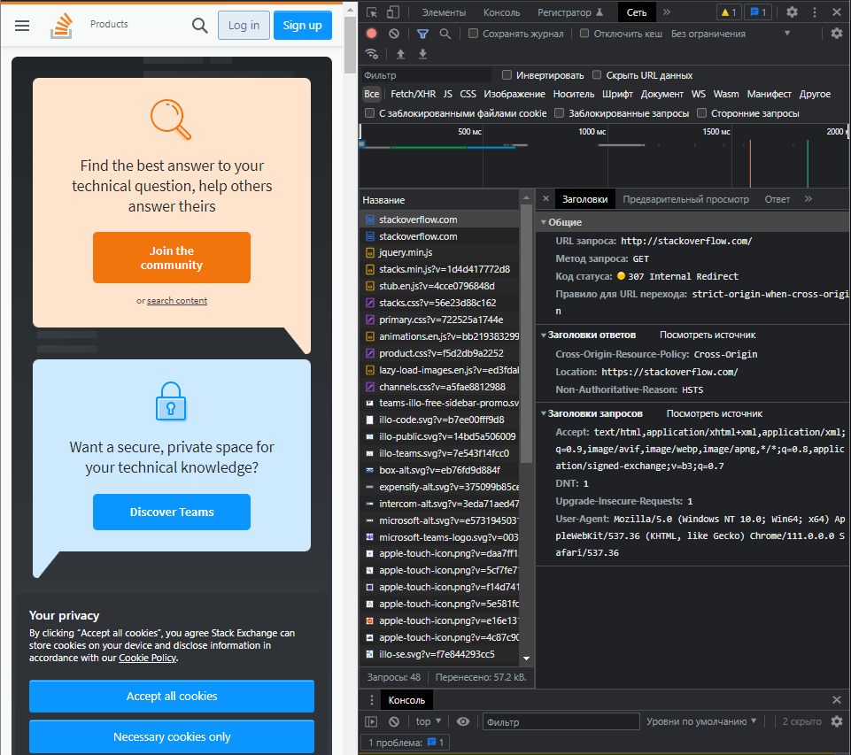
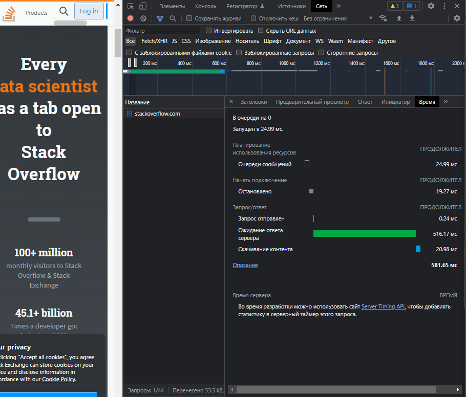

# Домашнее задание к занятию «Компьютерные сети. Лекция 1»

**Шаг 1.** Работа c HTTP через telnet.

- Подключитесь утилитой telnet к сайту stackoverflow.com:

`telnet stackoverflow.com 80`
 
- Отправьте HTTP-запрос:

```bash
GET /questions HTTP/1.0
HOST: stackoverflow.com
[press enter]
[press enter]
```
*В ответе укажите полученный HTTP-код и поясните, что он означает.*

##### Ответ:

```bash
vagrant@vagrant:~$ telnet stackoverflow.com 80
Trying 151.101.193.69...
Connected to stackoverflow.com.
Escape character is '^]'.
GET /questions HTTP/1.0
HOST: stackoverflow.com

HTTP/1.1 403 Forbidden //Полученный ответ
Connection: close
Content-Length: 1917
Server: Varnish
Retry-After: 0
Content-Type: text/html
Accept-Ranges: bytes
Date: Sat, 18 Mar 2023 06:55:13 GMT
Via: 1.1 varnish
X-Served-By: cache-hel1410031-HEL
X-Cache: MISS
X-Cache-Hits: 0
X-Timer: S1679122513.426462,VS0,VE1
X-DNS-Prefetch-Control: off
```
Код ответа на статус ошибки "HTTP 403 Forbidden" указывает, что сервер понял запрос, но отказывается его авторизовать. Доступ запрещён (например, у пользователя не хватает прав доступа к запрашиваемому ресурсу). После строк, приведённых мной выше, отобразился документ html, в котором я увидел строки, которые намекают, что наш IP-адрес заблокирован:

```bash
...
<div class="msg">
                        <h1>Access Denied</h1>
                        <p>This IP address (5.129.152.28) has been blocked from access to our services. If you believe this to be in error, please contact us at <a href="mailto:team@stackexchange.com?Subject=Blocked%205.129.152.28%20(Request%20ID%3A%202745700695-HEL)">team@stackexchange.com</a>.</p>
                        <p>When contacting us, please include the following information in the email:</p>
                        <p>Method: block</p>
...
```

---

**Шаг 2.** Повторите задание 1 в браузере, используя консоль разработчика F12:

 - откройте вкладку `Network`;
 - отправьте запрос [http://stackoverflow.com](http://stackoverflow.com);
 - найдите первый ответ HTTP-сервера, откройте вкладку `Headers`;
 - укажите в ответе полученный HTTP-код;
 - проверьте время загрузки страницы и определите, какой запрос обрабатывался дольше всего;
 - приложите скриншот консоли браузера в ответ.
 
 ##### Ответ:
 
 Полученный код - 307 Internal Redirect (Temporary Redirect), означает, что запрошенный ресурс был временно перемещён в URL-адрес, указанный в заголовке Location: https://stackoverflow.com/
 
 
 
 Время загрузки страницы 581.65 мс. Дольше всего обрабатывался запрос GET https://stackoverflow.com/ 
 
 
 
 ---

**Шаг 3.** Какой IP-адрес у вас в интернете?

##### Ответ:

---

**Шаг 4.** Какому провайдеру принадлежит ваш IP-адрес? Какой автономной системе AS? Воспользуйтесь утилитой `whois`.

##### Ответ:

---

**Шаг 5.** Через какие сети проходит пакет, отправленный с вашего компьютера на адрес 8.8.8.8? Через какие AS? Воспользуйтесь утилитой `traceroute`.

##### Ответ:

---

**Шаг 6.** Повторите задание 5 в утилите `mtr`. На каком участке наибольшая задержка — delay?

##### Ответ:

---

**Шаг 7.** Какие DNS-сервера отвечают за доменное имя dns.google? Какие A-записи? Воспользуйтесь утилитой `dig`.

##### Ответ:

---

**Шаг 8.** Проверьте PTR записи для IP-адресов из задания 7. Какое доменное имя привязано к IP? Воспользуйтесь утилитой `dig`.

##### Ответ:

---
