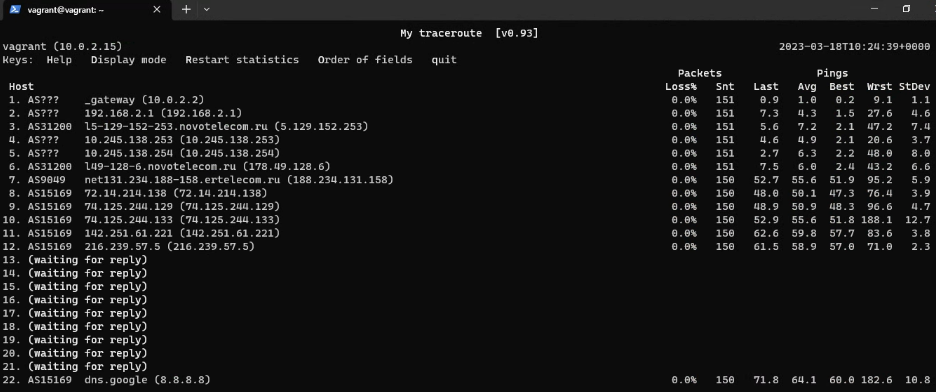

# Домашнее задание к занятию «Компьютерные сети. Лекция 1»

**Шаг 1.** Работа c HTTP через telnet.

- Подключитесь утилитой telnet к сайту stackoverflow.com:

`telnet stackoverflow.com 80`
 
- Отправьте HTTP-запрос:

```bash
GET /questions HTTP/1.0
HOST: stackoverflow.com
[press enter]
[press enter]
```
*В ответе укажите полученный HTTP-код и поясните, что он означает.*

##### Ответ:

```bash
vagrant@vagrant:~$ telnet stackoverflow.com 80
Trying 151.101.193.69...
Connected to stackoverflow.com.
Escape character is '^]'.
GET /questions HTTP/1.0
HOST: stackoverflow.com

HTTP/1.1 403 Forbidden //Полученный ответ
Connection: close
Content-Length: 1917
Server: Varnish
Retry-After: 0
Content-Type: text/html
Accept-Ranges: bytes
Date: Sat, 18 Mar 2023 06:55:13 GMT
Via: 1.1 varnish
X-Served-By: cache-hel1410031-HEL
X-Cache: MISS
X-Cache-Hits: 0
X-Timer: S1679122513.426462,VS0,VE1
X-DNS-Prefetch-Control: off
```
Код ответа "HTTP 403 Forbidden" указывает, что сервер понял запрос, но отказывается его авторизовать. Доступ запрещён (например, у пользователя не хватает прав доступа к запрашиваемому ресурсу). После строк, приведённых мной выше, отобразился документ html, в котором я увидел строки, которые намекают, что наш IP-адрес заблокирован:

```bash
...
<div class="msg">
                        <h1>Access Denied</h1>
                        <p>This IP address (5.129.152.28) has been blocked from access to our services. If you believe this to be in error, please contact us at <a href="mailto:team@stackexchange.com?Subject=Blocked%205.129.152.28%20(Request%20ID%3A%202745700695-HEL)">team@stackexchange.com</a>.</p>
                        <p>When contacting us, please include the following information in the email:</p>
                        <p>Method: block</p>
...
```

---

**Шаг 2.** Повторите задание 1 в браузере, используя консоль разработчика F12:

 - откройте вкладку `Network`;
 - отправьте запрос [http://stackoverflow.com](http://stackoverflow.com);
 - найдите первый ответ HTTP-сервера, откройте вкладку `Headers`;
 - укажите в ответе полученный HTTP-код;
 - проверьте время загрузки страницы и определите, какой запрос обрабатывался дольше всего;
 - приложите скриншот консоли браузера в ответ.
 
 ##### Ответ:
 
 Полученный код - 307 Internal Redirect (Temporary Redirect), означает, что запрошенный ресурс был временно перемещён в URL-адрес, указанный в заголовке Location: https://stackoverflow.com/
 
 
 
 Время загрузки страницы 581.65 мс. Дольше всего обрабатывался запрос GET https://stackoverflow.com/ 
 
 
 
 ---

**Шаг 3.** Какой IP-адрес у вас в интернете?

##### Ответ:

```bash
vagrant@vagrant:~$ curl ifconfig.me
5.129.152.28
```

---

**Шаг 4.** Какому провайдеру принадлежит ваш IP-адрес? Какой автономной системе AS? Воспользуйтесь утилитой `whois`.

##### Ответ:

Провайдер `Novotelecom Ltd.`, AS `AS31200`
```bash
vagrant@vagrant:~$ whois -h whois.radb.net 5.129.152.28
route:          5.129.128.0/19
descr:          Novotelecom Ltd.
origin:         AS31200
mnt-by:         RU-NTK-MNT
mnt-routes:     RU-NTK-MNT
created:        2016-06-20T09:04:26Z
last-modified:  2016-06-20T09:04:26Z
source:         RIPE
...
```

---

**Шаг 5.** Через какие сети проходит пакет, отправленный с вашего компьютера на адрес 8.8.8.8? Через какие AS? Воспользуйтесь утилитой `traceroute`.

##### Ответ:

```bash
vagrant@vagrant:~$ traceroute -IAn 8.8.8.8
traceroute to 8.8.8.8 (8.8.8.8), 30 hops max, 60 byte packets
 1  10.0.2.2 [*]  0.609 ms  0.555 ms  0.528 ms
 2  192.168.2.1 [*]  6.157 ms  6.133 ms  8.449 ms
 3  5.129.152.253 [AS31200]  9.125 ms  9.117 ms  9.105 ms
 4  10.245.138.253 [*]  8.920 ms  28.583 ms  28.834 ms
 5  10.245.138.254 [*]  19.949 ms  25.269 ms  27.419 ms
 6  178.49.128.6 [AS31200]  28.910 ms  3.694 ms  3.632 ms
 7  188.234.131.158 [AS9049]  53.579 ms  54.592 ms  55.164 ms
 8  72.14.214.138 [AS15169]  51.561 ms  52.116 ms  52.753 ms
 9  74.125.244.129 [AS15169]  53.942 ms  53.838 ms  53.554 ms
10  74.125.244.133 [AS15169]  58.368 ms  59.026 ms  58.925 ms
11  142.251.61.221 [AS15169]  65.090 ms  66.153 ms  62.798 ms
12  216.239.57.5 [AS15169]  62.173 ms  62.584 ms  57.565 ms
13  * * *
14  * * *
15  * * *
16  * * *
17  * * *
18  * * *
19  * * *
20  * * *
21  * * *
22  8.8.8.8 [AS15169/AS263411]  96.912 ms  60.949 ms  61.335 ms
```

---

**Шаг 6.** Повторите задание 5 в утилите `mtr`. На каком участке наибольшая задержка — delay?

##### Ответ:

```bash
vagrant@vagrant:~$ mtr -zbtc 333 8.8.8.8
```
Наибольшая задержка на `AS15169`  `8.8.8.8`



---

**Шаг 7.** Какие DNS-сервера отвечают за доменное имя dns.google? Какие A-записи? Воспользуйтесь утилитой `dig`.

##### Ответ:

---

**Шаг 8.** Проверьте PTR записи для IP-адресов из задания 7. Какое доменное имя привязано к IP? Воспользуйтесь утилитой `dig`.

##### Ответ:

---
