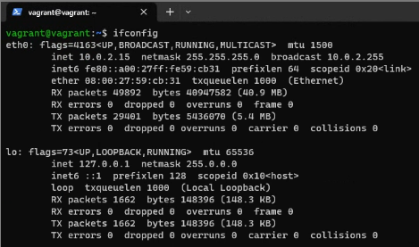
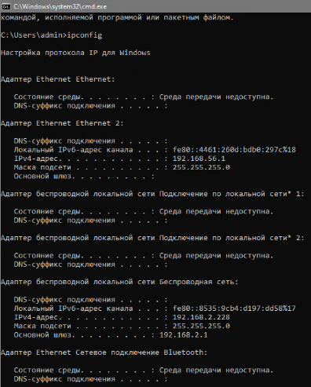

# Домашнее задание к занятию «Компьютерные сети. Лекция 2»


1. Проверьте список доступных сетевых интерфейсов на вашем компьютере. Какие команды есть для этого в Linux и в Windows?

##### Ответ:

`ifconfig` Linux  



`ipconfig` Windows  

  

---

2. Какой протокол используется для распознавания соседа по сетевому интерфейсу? Какой пакет и команды есть в Linux для этого?

##### Ответ:

Используется протокол канального уровня `LLDP`, позволяющий сетевым устройствам передавать информацию о себе и своих возможностях и получать подобную информацию о соседних устройствах. Пакет
```bash
vagrant@vagrant:~$ lldpd -v
1.0.4
```
Команды пакета
```bash
vagrant@vagrant:~$ lldpcli
[lldpcli] $ show interfaces
-------------------------------------------------------------------------------
LLDP interfaces:
-------------------------------------------------------------------------------
Interface:    eth0, via: unknown, Time: 0 day, 00:27:05
  Chassis:
    ChassisID:    mac 08:00:27:59:cb:31
    SysName:      vagrant
    SysDescr:     Ubuntu 20.04.5 LTS Linux 5.4.0-135-generic #152-Ubuntu SMP Wed Nov 23 20:19:22 UTC 2022 x86_64
    MgmtIP:       10.0.2.15
    MgmtIP:       fe80::a00:27ff:fe59:cb31
    Capability:   Bridge, off
    Capability:   Router, off
    Capability:   Wlan, off
    Capability:   Station, on
  Port:
    PortID:       mac 08:00:27:59:cb:31
    PortDescr:    eth0
  TTL:          120
-------------------------------------------------------------------------------
[lldpcli] $ show neighbors ports eth0
-------------------------------------------------------------------------------
LLDP neighbors:
-------------------------------------------------------------------------------
[lldpcli] $ ^C
vagrant@vagrant:~$ lldpctl
-------------------------------------------------------------------------------
LLDP neighbors:
-------------------------------------------------------------------------------
```

```bash
vagrant@vagrant:~$ systemctl status lldpd
● lldpd.service - LLDP daemon
     Loaded: loaded (/lib/systemd/system/lldpd.service; enabled; vendor preset: enabled)
     Active: active (running) since Sun 2023-03-26 06:20:52 UTC; 3h 14min ago
       Docs: man:lldpd(8)
   Main PID: 44807 (lldpd)
      Tasks: 2 (limit: 2273)
     Memory: 2.5M
     CGroup: /system.slice/lldpd.service
             ├─44807 lldpd: monitor.
             └─44824 lldpd: no neighbor.

Mar 26 06:20:52 vagrant systemd[1]: Started LLDP daemon.
Mar 26 06:20:52 vagrant lldpd[44824]: /etc/localtime copied to chroot
Mar 26 06:20:52 vagrant lldpd[44824]: protocol LLDP enabled
Mar 26 06:20:52 vagrant lldpd[44824]: protocol CDPv1 disabled
Mar 26 06:20:52 vagrant lldpd[44824]: protocol CDPv2 disabled
Mar 26 06:20:52 vagrant lldpd[44824]: protocol SONMP disabled
Mar 26 06:20:52 vagrant lldpd[44824]: protocol EDP disabled
Mar 26 06:20:52 vagrant lldpd[44824]: protocol FDP disabled
Mar 26 06:20:52 vagrant lldpd[44824]: libevent 2.1.11-stable initialized with epoll method
Mar 26 06:20:52 vagrant lldpcli[44823]: lldpd should resume operations
```

---

3. Какая технология используется для разделения L2-коммутатора на несколько виртуальных сетей? Какой пакет и команды есть в Linux для этого? Приведите пример конфига.

##### Ответ:  

Используется технология `VLAN`. В Linux есть пакет vlan `vlan/focal-updates,now 2.0.4ubuntu1.20.04.1 all`. Можно использовать команду `vconfig add` из пакета  

```bash
vagrant@vagrant:~$ sudo vconfig add eth0 10

Warning: vconfig is deprecated and might be removed in the future, please migrate to ip(route2) as soon as possible!
vagrant@vagrant:~$ sudo ip link set eth0.10 up
vagrant@vagrant:~$ sudo ip a add 192.168.2.227/255.255.255.0 dev eth0.10
vagrant@vagrant:~$ ip a
1: lo: <LOOPBACK,UP,LOWER_UP> mtu 65536 qdisc noqueue state UNKNOWN group default qlen 1000
    link/loopback 00:00:00:00:00:00 brd 00:00:00:00:00:00
    inet 127.0.0.1/8 scope host lo
       valid_lft forever preferred_lft forever
    inet6 ::1/128 scope host
       valid_lft forever preferred_lft forever
2: eth0: <BROADCAST,MULTICAST,UP,LOWER_UP> mtu 1500 qdisc fq_codel state UP group default qlen 1000
    link/ether 08:00:27:59:cb:31 brd ff:ff:ff:ff:ff:ff
    inet 10.0.2.15/24 brd 10.0.2.255 scope global dynamic eth0
       valid_lft 48648sec preferred_lft 48648sec
    inet6 fe80::a00:27ff:fe59:cb31/64 scope link
       valid_lft forever preferred_lft forever
3: eth0.10@eth0: <BROADCAST,MULTICAST,UP,LOWER_UP> mtu 1500 qdisc noqueue state UP group default qlen 1000
    link/ether 08:00:27:59:cb:31 brd ff:ff:ff:ff:ff:ff
    inet 192.168.2.227/24 scope global eth0.10
       valid_lft forever preferred_lft forever
    inet6 fe80::a00:27ff:fe59:cb31/64 scope link
       valid_lft forever preferred_lft forever

```

Можно осуществить настройку через `ip`, так как нас к этому призывают `please migrate to ip...`
```bash
vagrant@vagrant:~$ sudo ip link add link eth0 name eth0.20 type vlan id 20
vagrant@vagrant:~$ sudo ip a add 192.168.2.229/255.255.255.0 dev eth0.20
vagrant@vagrant:~$ sudo ip link set eth0.20 up
vagrant@vagrant:~$ ip a
1: lo: <LOOPBACK,UP,LOWER_UP> mtu 65536 qdisc noqueue state UNKNOWN group default qlen 1000
    link/loopback 00:00:00:00:00:00 brd 00:00:00:00:00:00
    inet 127.0.0.1/8 scope host lo
       valid_lft forever preferred_lft forever
    inet6 ::1/128 scope host
       valid_lft forever preferred_lft forever
2: eth0: <BROADCAST,MULTICAST,UP,LOWER_UP> mtu 1500 qdisc fq_codel state UP group default qlen 1000
    link/ether 08:00:27:59:cb:31 brd ff:ff:ff:ff:ff:ff
    inet 10.0.2.15/24 brd 10.0.2.255 scope global dynamic eth0
       valid_lft 47705sec preferred_lft 47705sec
    inet6 fe80::a00:27ff:fe59:cb31/64 scope link
       valid_lft forever preferred_lft forever
4: eth0.20@eth0: <BROADCAST,MULTICAST,UP,LOWER_UP> mtu 1500 qdisc noqueue state UP group default qlen 1000
    link/ether 08:00:27:59:cb:31 brd ff:ff:ff:ff:ff:ff
    inet 192.168.2.229/24 scope global eth0.20
       valid_lft forever preferred_lft forever
    inet6 fe80::a00:27ff:fe59:cb31/64 scope link
       valid_lft forever preferred_lft forever
```
Чтобы сделать виртуальный интерфейс постоянным, в нашей машине правим файл `/etc/netplan/01-netcfg.yaml`

```bash
vagrant@vagrant:~$ sudo nano /etc/netplan/01-netcfg.yaml
network:
  version: 2
  ethernets:
    eth0:
      dhcp4: true
  vlans:
    eth0.300:
      id: 300
      link: eth0
      addresses: [192.168.2.228/24]
vagrant@vagrant:~$ sudo netplan apply
vagrant@vagrant:~$ ip a
1: lo: <LOOPBACK,UP,LOWER_UP> mtu 65536 qdisc noqueue state UNKNOWN group default qlen 1000
    link/loopback 00:00:00:00:00:00 brd 00:00:00:00:00:00
    inet 127.0.0.1/8 scope host lo
       valid_lft forever preferred_lft forever
    inet6 ::1/128 scope host
       valid_lft forever preferred_lft forever
2: eth0: <BROADCAST,MULTICAST,UP,LOWER_UP> mtu 1500 qdisc fq_codel state UP group default qlen 1000
    link/ether 08:00:27:59:cb:31 brd ff:ff:ff:ff:ff:ff
    inet 10.0.2.15/24 brd 10.0.2.255 scope global dynamic eth0
       valid_lft 86398sec preferred_lft 86398sec
    inet6 fe80::a00:27ff:fe59:cb31/64 scope link
       valid_lft forever preferred_lft forever
5: eth0.300@eth0: <BROADCAST,MULTICAST,UP,LOWER_UP> mtu 1500 qdisc noqueue state UP group default qlen 1000
    link/ether 08:00:27:59:cb:31 brd ff:ff:ff:ff:ff:ff
    inet 192.168.2.228/24 brd 192.168.2.255 scope global eth0.300
       valid_lft forever preferred_lft forever
    inet6 fe80::a00:27ff:fe59:cb31/64 scope link
       valid_lft forever preferred_lft forever
```

---

4. Какие типы агрегации интерфейсов есть в Linux? Какие опции есть для балансировки нагрузки? Приведите пример конфига.

##### Ответ:

В Linux применяется тип агрегации (объединения нескольких физических каналов предачи в один логический) `bonding` и `teaming`.  Существует ряд опций для балансировки нагрузки:

```bash
0 - balance-rr - (round-robin)

1 - active-backup

2 - balance-xor

3 - broadcast

4 - 802.3ad - (dynamic link aggregation)

5 - balance-tlb - (adaptive transmit load balancing)

6 - balance-alb - (adaptive load balancing)
```

Приступаем к настройке:

```bash
vagrant@vagrant:~$ sudo apt install ifenslave
vagrant@vagrant:~$ sudo modprobe bonding
vagrant@vagrant:~$ lsmod | grep bonding
bonding               167936  0
vagrant@vagrant:~$ sudo nano /etc/netplan/01-netcfg.yaml
network:
  version: 2
  ethernets:
    eth0:
      dhcp4: true
    eth10:
      dhcp4: no
    eth11:
      dhcp4: no
  bonds:
    bond0:
      addresses: [192.168.2.222/24]
      interfaces: [eth10, eth11]
      parameters:
        mode: balance-rr
  vlans:
    eth0.300:
      id: 300
      link: eth0
      addresses: [192.168.2.228/24]
vagrant@vagrant:~$ sudo netplan apply
vagrant@vagrant:~$ ip a show bond0
6: bond0: <NO-CARRIER,BROADCAST,MULTICAST,MASTER,UP> mtu 1500 qdisc noqueue state DOWN group default qlen 1000
    link/ether 46:f5:21:ee:2a:7e brd ff:ff:ff:ff:ff:ff
    inet 192.168.2.222/24 brd 192.168.2.255 scope global bond0
       valid_lft forever preferred_lft forever
```

---

5. Сколько IP-адресов в сети с маской /29 ? Сколько /29 подсетей можно получить из сети с маской /24. Приведите несколько примеров /29 подсетей внутри сети 10.10.10.0/24.

##### Ответ:

---

6. Задача: вас попросили организовать стык между двумя организациями. Диапазоны 10.0.0.0/8, 172.16.0.0/12, 192.168.0.0/16 уже заняты. Из какой подсети допустимо взять частные IP-адреса? Маску выберите из расчёта — максимум 40–50 хостов внутри подсети.

##### Ответ:

---

7. Как проверить ARP-таблицу в Linux, Windows? Как очистить ARP-кеш полностью? Как из ARP-таблицы удалить только один нужный IP?

##### Ответ:

---
