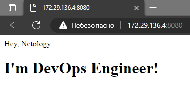

# Домашнее задание к занятию 3. «Введение. Экосистема. Архитектура. Жизненный цикл Docker-контейнера»

---

## Задача 1

Сценарий выполнения задачи:

- создайте свой репозиторий на https://hub.docker.com;
- выберите любой образ, который содержит веб-сервер Nginx;
- создайте свой fork образа;
- реализуйте функциональность:
запуск веб-сервера в фоне с индекс-страницей, содержащей HTML-код ниже:
```
<html>
<head>
Hey, Netology
</head>
<body>
<h1>I’m DevOps Engineer!</h1>
</body>
</html>
```

Опубликуйте созданный fork в своём репозитории и предоставьте ответ в виде ссылки на https://hub.docker.com/username_repo.

##### Ответ:

```bash
papercut@MP:~/build$ cat index.html
<html>
<head>
Hey, Netology
</head>
<body>
<h1>I&apos;m DevOps Engineer!</h1>
</body>
</html>

papercut@MP:~/build$ cat Dockerfile
FROM nginx:latest
COPY ./index.html /usr/share/nginx/html/index.html
```

Собираем свой образ в текущем контексте
```bash
papercut@MP:~/build$ sudo docker build -t mpvj/nginx .
[+] Building 2.1s (7/7) FINISHED
 => [internal] load .dockerignore                                                                                                        0.1s
 => => transferring context: 2B                                                                                                          0.0s
 => [internal] load build definition from Dockerfile                                                                                     0.1s
 => => transferring dockerfile: 108B                                                                                                     0.0s
 => [internal] load metadata for docker.io/library/nginx:latest                                                                          1.6s
 => CACHED [1/2] FROM docker.io/library/nginx:latest@sha256:af296b188c7b7df99ba960ca614439c99cb7cf252ed7bbc23e90cfda59092305             0.0s
 => [internal] load build context                                                                                                        0.0s
 => => transferring context: 131B                                                                                                        0.0s
 => [2/2] COPY ./index.html /usr/share/nginx/html/index.html                                                                             0.1s
 => exporting to image                                                                                                                   0.1s
 => => exporting layers                                                                                                                  0.1s
 => => writing image sha256:02f14f04df41445f7a7dbea6d845044cf278d6036e1216b1a3420eac199169b9                                             0.0s
 => => naming to docker.io/mpvj/nginx
```

Запускаем контейнер, наблюдаем его работу в процессах, проверяем наличие страницы в браузере

```bash
papercut@MP:~/build$ sudo docker run -it -d -p 8080:80 --name  nginx mpvj/nginx
86d88716dec00f0ee5129782a6c5ba01dfe57240d97341c5e14fac6c82d49788


papercut@MP:~/build$ sudo docker ps
CONTAINER ID   IMAGE        COMMAND                  CREATED         STATUS         PORTS                                   NAMES
86d88716dec0   mpvj/nginx   "/docker-entrypoint.…"   4 minutes ago   Up 4 minutes   0.0.0.0:8080->80/tcp, :::8080->80/tcp   nginx
```



Проверяем имеющиеся образы, тегируем и пушим в свой репозиторий

```bash
papercut@MP:~/build$ sudo docker images
REPOSITORY   TAG       IMAGE ID       CREATED          SIZE
mpvj/nginx   latest    02f14f04df41   12 minutes ago   143MB

papercut@MP:~/build$ sudo docker tag 02f14f04df41 mpvj/nginx:0.3

papercut@MP:~/build$ sudo docker images
REPOSITORY   TAG       IMAGE ID       CREATED          SIZE
mpvj/nginx   0.3       02f14f04df41   14 minutes ago   143MB
mpvj/nginx   latest    02f14f04df41   14 minutes ago   143MB


papercut@MP:~/build$ docker login -u mpvj
Password:

Login Succeeded

papercut@MP:~/build$ sudo docker push mpvj/nginx:0.3
The push refers to repository [docker.io/mpvj/nginx]
8d34f06f5ecc: Pushed
4fd834341303: Mounted from library/nginx
5e099cf3f3c8: Mounted from library/nginx
7daac92f43be: Mounted from library/nginx
e60266289ce4: Mounted from library/nginx
4b8862fe7056: Mounted from library/nginx
8cbe4b54fa88: Mounted from library/nginx
0.3: digest: sha256:710ac5d2c606569f237fbef3ea10410bf58b82a1159e21ea492106ec8f7441cb size: 1778
```

Ссылка на созданный форк в репозитории https://hub.docker.com/r/mpvj/nginx

---

## Задача 2

Посмотрите на сценарий ниже и ответьте на вопрос:
«Подходит ли в этом сценарии использование Docker-контейнеров или лучше подойдёт виртуальная машина, физическая машина? Может быть, возможны разные варианты?»

Детально опишите и обоснуйте свой выбор.

--

Сценарий:

- высоконагруженное монолитное Java веб-приложение;
- Nodejs веб-приложение;
- мобильное приложение c версиями для Android и iOS;
- шина данных на базе Apache Kafka;
- Elasticsearch-кластер для реализации логирования продуктивного веб-приложения — три ноды elasticsearch, два logstash и две ноды kibana;
- мониторинг-стек на базе Prometheus и Grafana;
- MongoDB как основное хранилище данных для Java-приложения;
- Gitlab-сервер для реализации CI/CD-процессов и приватный (закрытый) Docker Registry.

## Задача 3

- Запустите первый контейнер из образа ***centos*** c любым тегом в фоновом режиме, подключив папку ```/data``` из текущей рабочей директории на хостовой машине в ```/data``` контейнера.

```bash
papercut@MP:~/data$ sudo docker run -dt -v /home/papercut/data:/data --name centos centos
6c0a8bc9e08046d98d9c3091aac0af75f17c470c41a3c4e7cff3bd9dd8df2c43
```

- Запустите второй контейнер из образа ***debian*** в фоновом режиме, подключив папку ```/data``` из текущей рабочей директории на хостовой машине в ```/data``` контейнера.

```bash
papercut@MP:~/data$ sudo docker run -dt -v /home/papercut/data:/data --name debian debian
76244ee9c0f2214a45df15063e4a17d16a36a3bdeb37da93d7d82c7f3bcbcf8c
```

- Подключитесь к первому контейнеру с помощью ```docker exec``` и создайте текстовый файл любого содержания в ```/data```.

```bash
papercut@MP:~/data$ sudo docker exec -it centos bash
[root@6c0a8bc9e080 /]# echo 'Hi from centos' > /data/file_from_centos.md
[root@6c0a8bc9e080 /]# exit
```

- Добавьте ещё один файл в папку ```/data``` на хостовой машине.

```bash
papercut@MP:~/data$ echo 'Hi from host' > file_from_host.md
```

- Подключитесь во второй контейнер и отобразите листинг и содержание файлов в ```/data``` контейнера.

```bash
papercut@MP:~/data$ sudo docker exec -it debian bash
root@76244ee9c0f2:/# ls -lah /data
total 16K
drwxr-xr-x 2 1000 1000 4.0K May 27 11:32 .
drwxr-xr-x 1 root root 4.0K May 27 11:30 ..
-rw-r--r-- 1 root root   15 May 27 11:31 file_from_centos.md
-rw-r--r-- 1 1000 1000   13 May 27 11:32 file_from_host.md
root@76244ee9c0f2:/# cat /data/file_from_centos.md
Hi from centos
root@76244ee9c0f2:/# cat /data/file_from_host.md
Hi from host
```

